<div align="center">

# 🚨 village-emrg

### Offline-first «тревожная кнопка» дачного посёлка

PWA на три уровня тревоги для соседской взаимопомощи и ДНД.<br/>
Работает без сети, доставляет позже. Не заменяет 112 — фиксирует факт и поднимает соседей.

<br/>

[](https://github.com/DmitrTRC/village-emergency/actions/workflows/ci.yml)
[](https://dmitrtrc.github.io/village-emergency/)
[](LICENSE)

[](https://nodejs.org)
[](https://www.typescriptlang.org)
[](https://react.dev)
[](https://hono.dev)
[](https://www.postgresql.org)
[](https://web.dev/progressive-web-apps/)

[Витрина](https://dmitrtrc.github.io/village-emergency/) ·
[Roadmap](ROADMAP.md) ·
[Архитектура](docs/superpowers/specs/2026-06-11-village-emrg-design.md) ·
[Безопасность](SECURITY.md)

<br/>



</div>

---

## Что это

Дачный посёлок (~150 домов), неравномерная связь (LTE/2G/нет), один командир ДНД.
Жителю нужно за одно нажатие поднять тревогу — даже когда сети нет. Приложение:

- ставит инцидент в **локальную очередь** (IndexedDB) и отправляет, как только появится сеть;
- даёт **карточку-статус** «⏳ ожидает сети → доставлено → принято командиром»;
- рассылает **push** (VAPID) и **live-обновления** ленты (SSE поверх Postgres `LISTEN/NOTIFY`);
- держит **аудит-журнал** каждого перехода (append-only `incident_events`).

> Приложение **не заменяет 112**. Это тревожная кнопка для соседей и фиксированный лог факта.

## Три уровня тревоги

| Уровень | Когда | Видимость |
| --- | --- | --- |
| 🔴 **Emergency** | критическая ситуация прямо сейчас | публичен сразу при доставке |
| 🟡 **Правонарушение** | уже произошло, разбор на уровне ДНД | приватен до «принято» командиром |
| 🔵 **Внимание** | подозрительные машины/люди | приватен до «принято» командиром |

## Ключевые решения

- **Offline-first**: UUIDv7 генерится на клиенте, POST идемпотентен — повтор не плодит дублей.
- **Один процесс, один VPS**: Hono + grammy + push-диспетчер в одном Node-процессе. Никакого Redis, никакого отдельного WebSocket-сервера — хватает Postgres `LISTEN/NOTIFY`.
- **Telegram как фактор владения**: регистрация и логин через бота, модерация командиром. Без паролей.
- **PII-минимум**: обязателен только адрес дома; телефон опционален. Список домов и фамилий — не в репозитории.
- **Прямая загрузка медиа**: фото жмётся в WebP на клиенте и грузится в S3 по pre-signed PUT, минуя бэкенд.

## Стек

| Слой | Технологии |
| --- | --- |
| Фронт | React 18 · Vite 5 · TypeScript · Workbox Service Worker · MapLibre GL |
| Бэк | Node 22 · Hono · grammy (Telegram) · web-push |
| Данные | PostgreSQL 16 · Drizzle ORM · Zod (единый источник схем) |
| Хранилище | Selectel Object Storage (S3-совместимый, pre-signed) |
| Деплой | Docker Compose · Caddy (auto-TLS) · Selectel VPS |
| Тесты | Vitest · testcontainers (Postgres) · Playwright (E2E) |

## Структура

```
village-emrg/
├─ packages/
│  ├─ shared/   Zod-схемы DTO — единый источник правды фронта и бэка
│  ├─ server/   Hono API · Drizzle · auth · домен (policy, lifecycle) · Telegram-бот
│  └─ web/      React PWA · offline-очередь · SSE · push · карта
├─ docs/        design-спека, планы, deploy, ручные тесты
├─ assets/      схема архитектуры
└─ site/        лендинг-витрина (GitHub Pages)
```

## Быстрый старт

```bash
pnpm install            # Node 22, pnpm 9
pnpm typecheck          # tsc по всем пакетам
pnpm test               # vitest (серверные тесты поднимают Postgres через testcontainers — нужен Docker)
pnpm build              # сборка всех пакетов
```

Локальный запуск дев-серверов — из отдельных вкладок (не из агента):

```bash
pnpm --filter @village/server dev    # API на :8787
pnpm --filter @village/web dev       # PWA на :5173
```

Демо-сборка для показа: `./scripts/demo.sh`.
Переменные окружения — см. `.env.example`.

## Тесты

- **Unit** (Vitest) — Zod-схемы, `policy.ts` (role × level × status × visibility), переходы жизненного цикла.
- **Integration** (Vitest + testcontainers) — полный цикл инцидента через Hono-handlers, идемпотентность, `LISTEN/NOTIFY → SSE`.
- **E2E** (Playwright) — «житель создаёт Emergency offline → сеть вернулась → проверка у командира».

CI ([`.github/workflows/ci.yml`](.github/workflows/ci.yml)) гоняет typecheck + unit/integration на каждый push и PR в `main`.

## Деплой

Docker Compose + Caddy на одном VPS. Подробно — [`docs/deploy.md`](docs/deploy.md).

## Безопасность

Сообщения об уязвимостях — приватно, см. [`SECURITY.md`](SECURITY.md). Секреты только в `.env` (0600), в репозитории — плейсхолдеры.

## Лицензия

Проприетарная — для внутреннего использования посёлка. См. [`LICENSE`](LICENSE).

<div align="center"><sub>Сделано для посёлка · brainstorming с Claude · одним разработчиком</sub></div>
